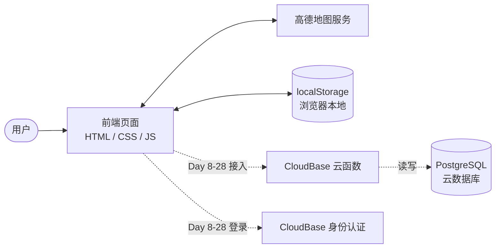

# TripMemo 技术设计

> 对应课程：Vibe Coding 五步工作流 第 ③ 步「技术设计」｜Day 5
> 上游依据：`PRD.md`（Day 4）
> 本期范围：**Day 7 交付 MVP**
> 本文件**不含代码**（代码从 Day 7 开始写）

---

## 一、技术路线（一句话总览）

**一张纯静态网页 + 高德地图 + 浏览器本地存储 —— 不需要服务器，也不需要数据库。**

配套的三个关键点：

1. **全部逻辑跑在浏览器里**（前端），因为本项目只有用户自己看自己的数据，没有"别人"，也就没有"能改它而得利"的人
2. **数据只存在用户自己的浏览器里**，不上传任何服务器
3. **地图由高德提供**（页面运行需要联网，但这不等于上传用户数据）

---

## 二、技术栈清单（选了什么 + 为什么 + 代价）

### 2.1 总表

| 层 | 选择 | 为什么选它 | 代价（要认的） |
|---|---|---|---|
| **页面结构** | 原生 **HTML** | 页面骨架，天然就要用 | — |
| **样式** | 原生 **CSS** | 不引入 UI 框架，少一层依赖 | 界面需要自己写，没有现成组件 |
| **交互逻辑** | 原生 **JavaScript** | ① 零构建工具，写完双击就能看<br>② MVP 只有 4 个视图，**用框架等于高射炮打蚊子**<br>③ 省掉 1–2 天的工具链配置时间 | 项目变大后，代码要靠自己分文件组织 |
| **地图** | **高德地图 JS API（Web 端）** | ① **国内快且稳**——你验收要现场跑得出来，地图白屏就直接挂<br>② 教程与社区资料最多，踩坑好查<br>③ 个人额度 **1 万次/月**，本项目远用不到<br>④ 有 Key + 安全密钥 + 白名单机制，正好把"密钥管理"这一课真正走一遍 | ① **需要注册 + 实名认证（提交身份证）**<br>② Key 与安全密钥要自己管好 |
| **数据存储** | 浏览器 **localStorage** | ① 零成本、不需要后端<br>② MVP 数据量（几十个地点）完全够 | **换设备 / 换浏览器 / 清缓存 → 数据全丢**（PRD 已用「导出 JSON」兜底） |
| **部署** | **本地打开文件**（为主） | 验收随时能跑，不依赖任何网络 | 没有公开链接（GitHub Pages 属后续，见 6.4） |

### 2.2 为什么不用框架 / 不用后端（把"没选什么"也写清）

| 没选的东西 | 为什么 |
|---|---|
| React / Vue 等前端框架 | 需要构建工具链，配置成本高，与"4 个视图"的规模不匹配 |
| 后端服务（Node.js / Python） | 本项目没有"别人"能碰到数据，不需要服务器做判断；加了只会增加部署与运维成本 |
| 数据库（MySQL / MongoDB 等） | MVP 数据量小，localStorage 够用；数据库放在 Day 8–28 引入 |
| 构建工具（Vite / webpack） | 原生三件套直接跑，不需要打包 |

---

### 2.3 项目结构（文件怎么组织）

**划分原则**：**一个视图一个文件**，数据读写**只在一处收口**。

```
Vibe Coding/                    ← 仓库根目录（GitHub 上的 tripmemo）
├─ index.html                   唯一页面：4 个视图都在里面，靠切换显示
├─ css/
│   └─ style.css                全站样式
├─ js/
│   ├─ main.js                  入口：加载配置、初始化、切换视图、导航
│   ├─ store.js                 数据层：读写 localStorage、导出 JSON（唯一数据出口）
│   ├─ model.js                 数据模型：地点结构、停留时长、点大小/线宽算法
│   ├─ map.js                   地图视图（打点、点大小、筛选、锚点、连线）
│   ├─ timeline.js              时间轴视图
│   ├─ places.js                地点列表视图（城市分组）
│   └─ detail.js                详情弹窗（查看态 / 编辑态 / 新增态）
├─ config.js                    ⚠️ 高德 Key + 安全密钥（**不提交**，在 .gitignore 里）
├─ config.example.js            Key 模板（提交，只有占位符）
├─ AGENTS.md                    项目规则（Day 1）
├─ research.md                  需求研究（Day 3）
├─ PRD.md                       产品需求文档（Day 4）
├─ TECH_DESIGN.md               本文件（Day 5）
└─ .gitignore
```

#### 每个文件的职责

| 文件 | 干什么 | 为什么单独成一个文件 |
|---|---|---|
| `index.html` | 4 个视图的容器 + 详情弹窗的容器 | 单页应用，所有视图共用一张页面 |
| `js/main.js` | 启动：读 `config.js`、初始化数据、渲染默认视图、处理视图切换 | 入口只做"装配"，不写业务 |
| `js/store.js` | **所有** localStorage 的读写、导出 JSON | **数据只从这一个口子进出**——以后换成云数据库时，只改这里 |
| `js/model.js` | 定义"地点"长什么样、停留时长怎么算、点大小/线宽怎么换算 | 纯计算，不碰界面，最容易单独验证 |
| `js/map.js` | 地图视图全部：打点、筛选、悬停、锚点、连线、线宽 | 地图逻辑最重，单独隔离 |
| `js/timeline.js` | 时间轴视图 | 一个视图一个文件 |
| `js/places.js` | 地点列表视图（城市分组、展开收起） | 同上 |
| `js/detail.js` | 详情弹窗的三种形态与表单校验 | 三种形态共享同一套表单，必须在一起 |
| `css/style.css` | 全站样式 | 只有一个视图同时可见 |
| `config.js` | 高德 Key | **不提交**；别人克隆后照 `config.example.js` 自己填 |
| `config.example.js` | Key 模板 | 让克隆者知道要填什么，但不泄露真 Key |

#### 对应检查：PRD 的页面与功能，都能落到具体文件吗？

| PRD 里的页面 / 功能 | 落在哪 | 对得上？ |
|---|---|---|
| 5.1 地图视图 | `js/map.js` + `css/style.css` | ✅ |
| 5.2 时间轴视图 | `js/timeline.js` | ✅ |
| 5.3 地点列表视图 | `js/places.js` | ✅ |
| 5.4 详情弹窗（查看 / 编辑 / 新增三态） | `js/detail.js` | ✅ |
| 4.1 #1 地图打点（点击 + 搜索） | `js/map.js`（选点）→ `js/detail.js`（新增态） | ✅ |
| 4.1 #2 地点类型（4 类 + 筛选） | `js/model.js`（枚举）+ `js/map.js`（筛选）+ `js/detail.js`（选择） | ✅ |
| 4.1 #3 点的视觉差异 | `js/model.js`（算法）+ `js/map.js`（绘制） | ✅ |
| 4.1 #4 回忆表单 | `js/detail.js` | ✅ |
| 4.1 #5 城市分组 | `js/places.js` | ✅ |
| 4.1 #6 时间轴 | `js/timeline.js` | ✅ |
| 4.1 #7 数据持久化 + 导出 JSON | `js/store.js`（**但按钮放哪，PRD 没写** → 见第七节） | ⚠️ |
| 4.1 #8 地点连线（主城市放射 + 线宽） | `js/map.js`（绘制）+ `js/store.js`（主城市存哪） | ✅ |
| 三个视图各自的空状态 | 各视图模块内 | ✅ |
| **4 个视图之间怎么切换** | `js/main.js` + `index.html` 的导航 | ⚠️ **PRD 没有定义导航** → 见第七节 |
| 地图服务凭据 | `config.js` → `js/main.js` 读取 | ✅ |
| 停留时长、"至今"文案 | `js/model.js` | ✅ |
| 验收标准 33 条 | 全部落在上述文件的职责范围内（无一条需要额外模块） | ✅ |

**结论：PRD 的 4 个页面 + 8 项功能 + 33 条验收标准，全部能落到上面的文件里，没有"无处安放"的东西。**

**但有 3 处，PRD 本身没写清**——已记入第七节「待反馈给 PRD 的问题」，**本技术设计按最合理的方式先行处理**：

| 缺口 | 本设计的临时处理 |
|---|---|
| PRD 没定义**导航**（4 个视图怎么切） | 在 `index.html` 顶部加一个导航栏，`js/main.js` 管切换 |
| PRD 没写**「导出 JSON」按钮放在哪个界面** | 放在导航栏（全局动作，任何视图都能点） |
| PRD 只说"主城市设置入口"，**没说形态** | 先做成地图视图里的一个下拉选择，`js/map.js` 处理 |

---

## 三、三个关键前提（决定项目能不能跑起来）

### 3.1 联网 vs 上传——这两件事必须分清

| 事项 | 情况 |
|---|---|
| 页面运行**是否需要联网** | ✅ **需要**——高德地图的底图与搜索由在线服务提供 |
| **用户数据是否上传** | ❌ **不上传**——地点与回忆只写在用户自己的浏览器里 |

**这与 `PRD.md` 第八节的边界一致**：不做后端、不上传数据 ≠ 不需要联网。

### 3.2 Key 与安全密钥怎么管（高德 JS API 2.0 需要两个）

| 项 | 做法 |
|---|---|
| 存放位置 | **单独一个文件 `config.js`**（放 Key 与安全密钥） |
| 是否提交 | **不提交**——把 `config.js` 写进 `.gitignore` |
| 给别人的模板 | 提交一个 **`config.example.js`**，里面只有占位符，没有真实 Key |
| 白名单 | **初学阶段留空**。留空表示不限制域名，本地双击打开（`file://`）也能跑；等有正式域名后再去后台配置 |
| ⚠️ 必须知道的事实 | **前端 Key 藏不住**——用户按 F12 就能看到。所以真正的防线**不是"藏"，而是白名单 + 用量监控** |

### 3.3 本地怎么打开（两种方式）

| 方式 | 适合 | 说明 |
|---|---|---|
| 双击 `index.html`（`file://`） | 快速看效果 | 需要 Key 白名单留空 |
| **起一个本地静态服务器** | 开发调试（**推荐**） | 更接近真实环境，避免 `file://` 的各种怪问题。本机已有 Python，一行命令即可 |

**建议**：开发时用本地服务器；给他人看或最终验收时两种都行。

---

## 四、技术路线怎么满足 PRD

| PRD 的要求 | 技术路线怎么做到 |
|---|---|
| 地图打点、点的大小随停留时长变化、主城市放射连线与线宽 | 由**高德地图 JS API** 负责绘制与交互 |
| 地点类型筛选、回忆表单、城市分组、时间轴 | 原生 HTML/CSS/JS 实现界面与逻辑 |
| 数据持久化 + 导出 JSON | 写入 **localStorage**；导出时在前端拼出 JSON 并触发浏览器下载 |
| 「本期不做后端、不上传数据」 | 全项目**没有一行服务器代码**，纯静态页面 |
| 验收标准 1–33 条 | 全部可在**前端单独完成**，不需要服务端参与 |
| 停留时长（"至今"按今天 − 开始时间计算） | 纯前端日期运算 |

---

## 五、数据流图

### 5.1 一句话说清：数据从哪来、到哪去

| 问题 | 答案 |
|---|---|
| **数据从哪来** | ① 用户手动输入（地点名、停留时段、回忆文字、标签）<br>② **高德地图服务**返回（点击/搜索得到的坐标与城市名）<br>③ （Day 8–28）**云数据库**返回以前存过的记录 |
| **数据到哪去** | ① 写进**浏览器 localStorage**（MVP 阶段唯一的"家"）<br>② （Day 8–28）写进 **CloudBase PostgreSQL**<br>③ 显示在地图、列表、时间轴上 |

### 5.2 数据流图

**实线 = 现在（Day 7 MVP）就有的流向；虚线 = Day 8–28 才会长出来的流向。**



**文字版（万一图没渲染出来）**：

```
用户 ──操作──▶ 前端页面 ──▶ localStorage（读写，MVP 的唯一数据家）
                    │
                    └──▶ 高德地图服务（要地图 / 查地名 / 坐标换城市名）

Day 8–28 追加：
前端页面 ──▶ CloudBase 云函数 ──▶ PostgreSQL（云端数据库）
前端页面 ──▶ CloudBase 身份认证（登录）
```

### 5.3 逐条说明（谁把数据给了谁）

| 数据 | 从哪来 | 到哪去 | 谁在用 |
|---|---|---|---|
| 地点名、停留时段、回忆正文、标签 | **用户输入** | localStorage | 详情弹窗、时间轴、城市分组 |
| 坐标、所属城市 | **高德**返回（点地图 / 搜地名） | localStorage（随地点一起存） | 地图打点、连线计算 |
| 点的直径、线宽 | **前端算**（由停留时长换算） | 不存（每次算） | 地图绘制 |
| 停留时长 | **前端算**（结束 − 开始；"至今"取今天） | 不存（每次算） | 点的大小、详情展示 |
| 地图底图与搜索候选 | **高德** | 不存 | 地图显示、搜索框 |
| （Day 8–28）账号 | CloudBase 身份认证 | 云端 | 登录态 |
| （Day 8–28）地点与回忆 | 前端 → 云函数 | PostgreSQL | 所有视图 |

### 5.4 三个关键结论（也是你「一句话说清」的答案）

**1｜MVP 阶段，你的数据一辈子不出这台电脑。**
除了向高德要地图，所有回忆内容**只在自己浏览器里转**。

**2｜唯一的"对外请求"是问高德要地图——发出去的只有"我要看这块地图"，不是你的回忆。**
这一点必须分清楚，否则你会以为"用了在线地图 = 数据上传了"。**不是。**

**3｜Day 8–28 加云之后，回忆内容才第一次离开浏览器。**
**到那时，"信任边界"才真正开始起作用**——因为数据第一次存到了"用户碰不到"的地方，也第一次有了"别人也可能访问"的问题（所以必须配账号与权限）。

### 5.5 迁移要点（Day 8–28 真正要动什么）

| # | 迁移项 | 要注意什么 |
|---|---|---|
| 1 | **localStorage → PostgreSQL** | 已存在本地的地点要**一次性导入**云数据库；导入后 localStorage 可以留作**离线缓存**，但**不能同时当唯一数据源**（否则两边不一致） |
| 2 | **前端增加"请求层"** | 原来的"直接读 localStorage"要改成"调云函数拿数据"；读写在**同一处收口**，否则以后每加一个字段都要改一圈 |
| 3 | **地图 Key 挪位** | MVP 阶段 Key 在 `config.js`（会被 F12 看到）；上云后可把"需要保密的调用"移到云函数里，Key 改为只存在云端 |
| 4 | **环境变量出现** | 数据库连接串、云端密钥写进 `.env`，**绝不提交**；届时 `.gitignore` 里那行 `.env` 才真正派上用场 |
| 5 | **错误处理从"几乎没有"变成"必须有"** | 本地存储几乎不会失败；上云后要处理：网络断、登录过期、额度超限、数据库超时 |

---

## 六、本期不做什么（技术边界）

1. **不做后端服务**、不做数据库（Day 8–28 才引入）
2. **不做账号与登录**（同上）
3. **不使用构建工具**（npm / Vite / webpack）
4. **不引入前端框架**（React / Vue）
5. **不做移动端原生 App**（只做网页）
6. **同期不做公开部署**：GitHub Pages 放在后续——国内访问不稳定，本期验收以本地打开为准

---

## 七、待反馈给 PRD 的问题（**只记录，不改 PRD**）

> 按你 Day 5 清单的「今日不做：回头大改 PRD」，这里**只记录**技术设计过程中发现的 PRD 小问题，**不改动 PRD 一个字**。

| # | 发现 | 级别 | 建议 |
|---|---|---|---|
| 1 | PRD 说「所属城市被**自动填入**」——实现上依赖高德的**逆地理编码**接口（坐标 → 城市名），**该接口可能失败或超时**，此时城市为空 | 建议级 | 城市为**必填**，自动填入失败时由用户**手动补填**即可，不会卡住。但需要在地点列表里区分出"城市待补"的地点 |
| 2 | 连线规则依赖"地点所属城市"与"主城市"的**字符串比较**；若某地点城市为空，它就无法参与连线 | 建议级 | 城市为空的地点**不参与连线**，其余逻辑不受影响 |
| 3 | 时间轴卡片的「正文摘要」**未定义字数** | 建议级 | 建议截取前 **30–50 字**，超出加省略号 |
| 4 | 导出 JSON 的**数据结构未定义** | 实现细节 | 由本技术设计确定（见 Day 7 实现时），不属 PRD 缺口 |
| 5 | 「搜索地名选点」同样依赖高德的**输入提示 / POI 搜索**接口，会消耗额度 | 实现细节 | 个人额度 1 万/月足够；不需要改 PRD |
| 6 | **PRD 没有定义「导航」**——5.1 / 5.2 / 5.3 各自写了包含元素，但**没写用户怎么从一个视图切到另一个** | **建议级偏上**（Day 7 必须有，否则三个视图根本进不去） | 本设计已在 `index.html` 加导航栏（见 2.3） |
| 7 | **「导出 JSON」按钮放在哪个界面没写**——4.1 #7 只说"点「导出 JSON」" | 建议级 | 本设计暂放导航栏（全局动作），见 2.3 |
| 8 | 5.1 提到「**主城市设置入口**」，但**没写它长什么样**（下拉？弹窗？） | 建议级 | 本设计暂定为地图视图里的一个下拉选择，见 2.3 |

**结论：以上 8 条都不构成「必须修改」级问题**——PRD 全部可用。

但 **6 / 7 / 8 三条属于"不写清也能做、只是会各做各样"的类型**：本技术设计已按最合理的方式先行定下（见 2.3），**建议 Day 7 之后把这三条补回 PRD**，让文档和实际做出来的东西一致。

---

## 八、尚未决定的事项

> **这一节的存在本身就是设计的一部分**：把"还没想清楚的"明确标出来，而不是假装什么都想好了。
> 以下每一条都是**知情的不确定**，不是遗漏。

### 8.1 本文件里尚未决定的事

| # | 尚未决定的事 | 现状（本文件怎么处理的） | 什么时候必须定 | 谁定 |
|---|---|---|---|---|
| 1 | **Day 8–28 的云端方案具体用什么** | 第五节数据流图里，虚线部分画的是 CloudBase 云函数 / PostgreSQL / 身份认证——**那是"一种可行做法"，不是已定路线**（示范路线已不采用） | Day 8 开工前 | **你**（可参考课程示范路线） |
| 2 | **部署方式**（第二段要公开链接时） | MVP 已定：本地打开文件。但 PRD 第二段的目标「可以发给朋友看」需要一个**公开网址**，用什么方式托管尚未定 | Day 8 之后 | **你** |
| 3 | **导出 JSON 的字段结构** | 第七节 #4 写了"由本技术设计确定（Day 7 实现时）"——**目前尚未定义具体结构** | Day 7 实现导出功能时 | 我提议 → 你确认 |
| 4 | 地图 Key 的**白名单** | 3.2 定的是"初学阶段**留空**"——这是**暂定值**，不是终态 | 有了正式域名之后 | **你** |
| 5 | 本地怎么打开：`file://` 还是本地服务器 | 3.3 给了两种，结论是"开发用服务器、验收两种都行"——**没有强制** | Day 7 开始写代码时 | 我建议用本地服务器 |
| 6 | **导航**、**导出按钮位置**、**主城市设置形态** | 2.3 已**临时定下**（导航栏 / 导航栏 / 下拉选择），但**PRD 里没有依据**（见第七节 #6 / #7 / #8） | Day 7 之后补回 PRD | **你确认** |
| 7 | Mermaid 数据流图**能不能正常渲染** | 文档里已备**文字版兜底**，但**尚未在 GitHub 上目视验证** | **本次推送后立刻看** | **你** |

### 8.2 已经从"未定"变成"已定"的（记录一下，免得反复纠结）

| 事项 | 结论 |
|---|---|
| **前端形态** | ✅ **原生 HTML / CSS / JavaScript**（不再考虑 React / Vite） |
| **后端** | ✅ 本期**不做** |
| **数据存储（MVP）** | ✅ 浏览器 **localStorage** |
| **部署（MVP）** | ✅ **本地打开文件** |
| **地图服务** | ✅ **高德地图 JS API（Web 端）** |

### 8.3 从 PRD 继承来的待定（不在本文件范围内）

`PRD.md` 第九节还有 **3 条**待定，与本文件不冲突，详见 PRD：

1. 线宽的上下限具体取值（Day 7 调视觉效果时定）
2. 「统计面板」在 Day 8–28 的具体范围（Day 8–28 再定）
3. 图片字段的数据格式（Day 8–28 再定）

---

## 附：本文件与上下游文档的关系

| 文档 | 回答的问题 | 状态 |
|---|---|---|
| `research.md` | 为什么做？别人怎么做的？ | ✅ Day 3 |
| `PRD.md` | 做成什么样？什么算做完？ | ✅ Day 4 |
| **本文件 `TECH_DESIGN.md`** | **用什么做？数据怎么流？** | ← 当前 |
| `index.html` 与代码 | 做出来 | Day 7 起 |
